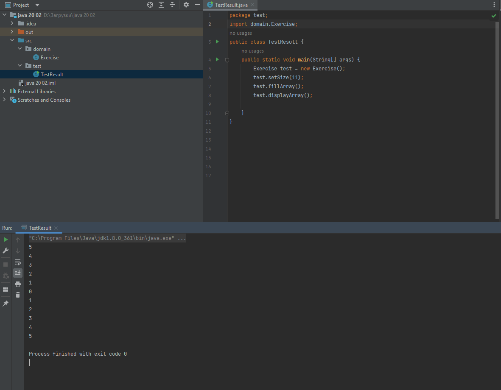

# Практична робота "Масиви, вирази, керування виконанням програми"
## 2. Заповнити масив довільного розміру числами в порядку зростання, починаючи з центру масиву, наприклад, ````[5,4,3,2,1,0,1,2,3,4,5]````
* Код класу Exercise
```java
package domain;

public class Exercise {

    /**
     * Атрибут для задання розміру.
     */
    private int N;

    /**
     * Масив, що зберігає цілі числа.
     */
    private int[] array;

    /**
     * Метод, який встановлює розмір та ініціалізує масив.
     *
     * @param n розмір масиву
     */
    public void setSize(int n) {
        N = n;
        array = new int[N];
    }

    /**
     * Метод виводу масива.
     */
    public void displayArray() {
        for (int elem : array) {
            System.out.println(elem);
        }
    }

    /**
     * Метод, що заповнює масив за завданням.
     */
    public void fillArray() {
        int j = 0;
        int k = 0;
        for (int i = N / 2; i < array.length; i++) {
            array[i] = j;
            j++;
        }
        for (int i = N / 2; i >= 0; i--) {
            array[i] = k;
            k++;
        }
    }
}
```

* Код класу TestResult

```java
package test;
import domain.Exercise;
public class TestResult {
    public static void main(String[] args) {
        Exercise test = new Exercise();
        test.setSize(11);
        test.fillArray();
        test.displayArray();

    }
}
```
----
## Результат роботи програми

