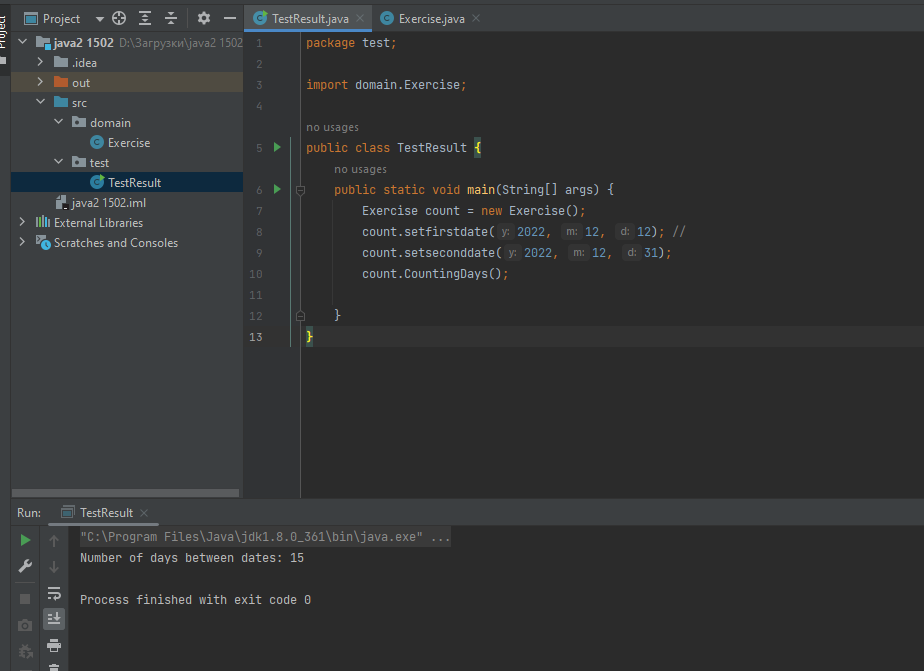

# Практична робота "Масиви, вирази, керування виконанням програми"
## 2. Заповнити масив довільного розміру числами в порядку зростання, починаючи з центру масиву, наприклад, ````[5,4,3,2,1,0,1,2,3,4,5]````
Цей репозиторій містить стартовий код для виконання практичної роботи, який містить заготовки двох класів, що демонструють структуру проекту для виконання завдань на масиви, керуючі конструкції та вирази. ##

* Код класу Exercise
```java
package domain;

import java.util.Random;

public class Exercise {

    /**
     * Атрибут для задання розміру.
     */
    private int N;

    /**
     * Масив, що зберігає випадкові числа.
     */
    private int array[];

    /**
     * Метод, який встановлює розмір та ініціалізує масив.
     *
     * @param n розмір масиву
     */
    public void setSize(int n) {
        N = n;
        array = new int[N];
    }

    /**
     * Об'єкт класу Random для генерації випадкових чисел.
     */
    private Random random = new Random();

    /**
     * Метод, який завонює масив випадковими числами.
     */
    public void GenArray() {
        for (int i = 0; i < array.length; i++) {
            array[i] = random.nextInt(100) + 1;
        }
    }

    /**
     * Метод виводу масива.
     */
    public void displayArray() {
        for (int i = 0; i < array.length; i++) {
            System.out.println(array[i] + " ");
        }
        System.out.println();
    }

    /**
     * Метод, що змінює елементи масиву за завданням.
     */
    public void updateArray() {
        int j = 0;
        for (int i = N / 2; i < array.length; i++) {
            array[i] = j;
            j++;
        }
    }
}
```

* Код класу TestResult

```java
package test;
import domain.Exercise;
public class TestResult {
    public static void main(String[] args) {
        Exercise test = new Exercise();
        test.setSize(10);
        test.GenArray();
        test.displayArray();
        test.updateArray();
        test.displayArray();

    }
}

```
----
## Результат роботи програми

